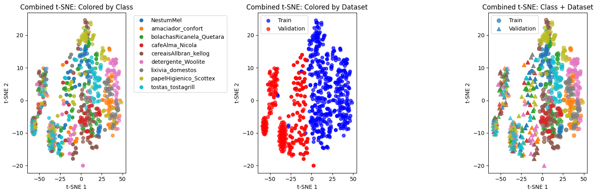

# Product Classification

## Challenge

Synthetic data for training and real data for testing.

## Pre-analysis

The synthetic images are cleaner than the real images, it is evident that some augmentations are needed. Furthermore, doing a t-sne analysis with simple modules like resnet-18 showed that the feature sape from training images is in a completely different embedding space than the validation images.

## Results

- Basic training (no augmentations) using base_config.yaml:
    - Validation accuracy : 39.26%
- Simple augmentations (rotation, color jitter, noise, and blur)
    - Validation accuracy : 35.58%
- RandAugment (from paper “RandAugment: Practical automated data augmentation with a reduced search space”)
    - Validation accuracy : 46.01%

## Conclusions

The current models do not perform satisfactory, even with simple augmentations the performance dropped slightly compared to the baseline. In the future work section, further improvements are suggested.

## Future work

- Use the masks of the synthetic images and create an artificial background (solid colors or noise, then based on textures, then use a generative model with related prompts such as "place this object in a shopping shelf")
- Do adversarial training based on domains. Here the domains can be artifially created images to look dimmer, brighter, noisier, blurier, and have a loss to penalize if the domain is correctly predicted by another classifier. Ideally, having access to real images and using synthetic vs real adversarial training
- Having real images it would also be possible to try and do feature alignment with the synthetic features so they can better represent the real images.
- Experiment with other stronger augmentations such as Mixup, Cutmix, or RandAugment
- Use other losses to focus on high confident true positives (like lixivia and amaciador)
- Add a hidden layer in classifier to have dropout layers
- Experiment with other backbones (for sake of time resnet-18 was used for simplicity)

## Limitations

Currently, the 9th extra class present in the validation but not in the training is not tackled. Personally, I would tacke this problem as an out of distribution problem. The simplest solution would be to see the confidence scores of the classes (probabilities) and if below a certain threshold consider it as an "other" class. More complex ideas is to condition the features from the hidden layers in the classifier to follow a gaussian distribution and measure how close to the distribution are the features of a new image (using Mahalanobis distance). 